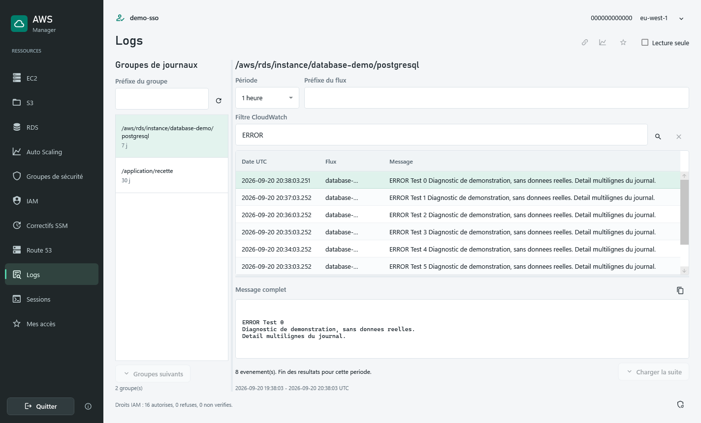
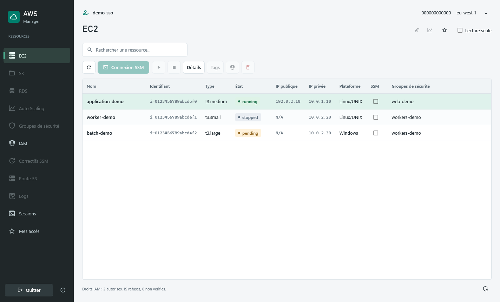
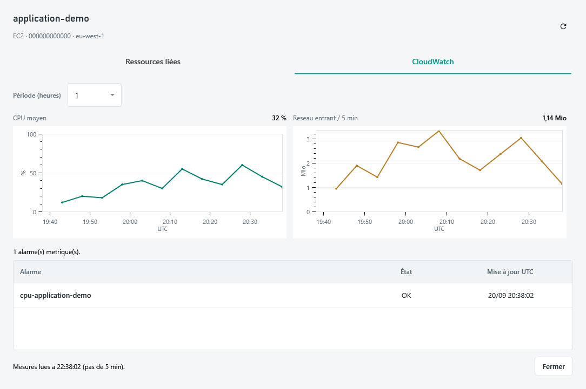
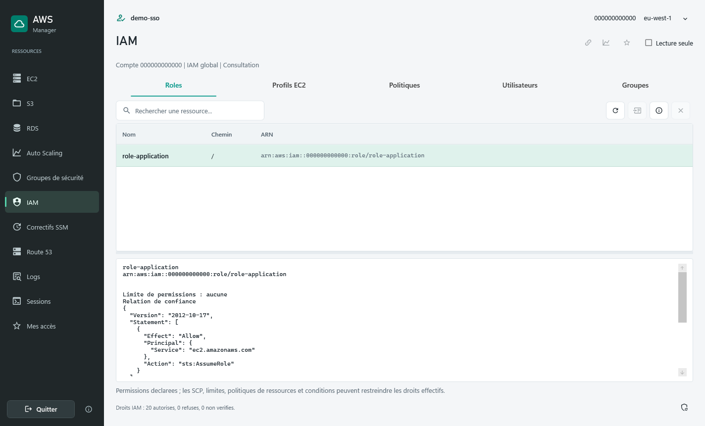

# AWS Manager

Application Windows WPF pour EC2, S3, RDS, Auto Scaling, groupes de securite,
Route 53, IAM, correctifs SSM, CloudWatch Logs et connexions SSM.
Cible : .NET 10 LTS, AWS SDK .NET v4.

## Apercu

Captures de l'interface reelle, generees hors ligne avec des donnees entierement
fictives. Aucun compte AWS reel ni identifiant personnel n'est utilise.

**Journaux CloudWatch** : recherche, filtrage et consultation des messages complets.



<details>
<summary>EC2 : inventaire et autorisations IAM</summary>

Instances, etats et informations reseau. Dans cet exemple, les autorisations IAM
limitent les actions disponibles a la consultation.



</details>

<details>
<summary>CloudWatch : metriques et alarmes</summary>

Courbes CPU et reseau d'une instance, avec ses alarmes CloudWatch.



</details>

<details>
<summary>IAM : roles et relations de confiance</summary>

Consultation des roles, profils EC2, politiques, utilisateurs et groupes.



</details>

## Demarrage

- Windows avec AWS CLI v2 et des profils locaux configures. Les profils SSO
  modernes (`sso-session`) et les profils classiques sont reconnus par le SDK.
- `session-manager-plugin` dans le PATH pour SSM ; client Bureau a distance pour RDP.
- Selectionner le profil et la region dans le bandeau commun a toutes les pages.
- **Verifier** reutilise les identifiants disponibles et controle l'identite avec STS.
  **Connexion SSO** lance la connexion AWS dans le navigateur puis verifie STS.
- Aucune requete d'inventaire n'est lancee au demarrage avant verification.
  Un changement de profil ou region detache les anciennes listes et selections.
  Il ne termine pas les sessions SSM deja ouvertes.

Depuis une GitHub Release, choisir l'un des deux formats :

- `AwsManager-v1.2.3-win-x64-Setup.exe` : installation pour l'utilisateur courant,
  sans droits administrateur, dans `%LOCALAPPDATA%\Programs\AwsManager`.
  Raccourci dans le menu Demarrer, raccourci Bureau facultatif et desinstallation
  depuis les parametres Windows. L'assistant est disponible en francais et anglais.
- `AwsManager-v1.2.3-win-x64.zip` : version portable a extraire integralement,
  puis lancer `AwsManager.exe` dans le dossier extrait.

Les deux formats embarquent .NET et les ressources anglaises/francaises.
Installer une nouvelle version remplace la precedente ; aucune mise a jour
automatique n'est integree. Les preferences dans `%LOCALAPPDATA%\AwsManager`
et les profils AWS ne sont pas supprimes par l'installateur ou la desinstallation.

Compilation et tests, depuis la racine avec le SDK .NET 10 :

```powershell
dotnet build AwsManager.csproj -c Release
dotnet test tests/AwsManager.Tests/AwsManager.Tests.csproj -c Release --logger trx
dotnet publish AwsManager.csproj -c Release -r win-x64 --self-contained true -o artifacts/AwsManager
```

Lancer `artifacts/AwsManager/AwsManager.exe`. Conserver tout le dossier publie.
Le runtime .NET est inclus ; AWS CLI et le plugin SSM restent des prerequis externes.
Si une instance verrouille la sortie Release, compiler avec
`-p:OutputPath=bin/AgentCheck/`, sans fermer cette instance de force.

Pour generer aussi l'installateur apres publication, utiliser Inno Setup 6.3 ou
ulterieur (serie 6), avec `ISCC.exe` accessible depuis le terminal :

```powershell
ISCC.exe /DAppVersion=1.2.3 /DAppNumericVersion=1.2.3 installer/AwsManager.iss
```

Le [script Inno Setup](installer/AwsManager.iss) lit `artifacts/AwsManager` et
produit le setup dans `artifacts/release`. Pour une prerelease, passer par exemple
`/DAppVersion=1.2.3-rc.1` et conserver `/DAppNumericVersion=1.2.3`.

## Automatisation GitHub

- [CI .NET](.github/workflows/dotnet.yml) : compilation et tests sous Windows sur
  les push/PR vers `master`, ou lancement manuel. La categorie `LiveReadOnly` est exclue :
  aucun profil ni secret AWS n'est requis. Les rapports TRX sont conserves meme
  en cas d'echec des tests ; rapports et application Windows restent disponibles
  comme artefacts pendant 3 jours. Les executions depassees d'une PR sont annulees.
- [CodeQL](.github/workflows/codeql.yml) : analyse C# avec compilation WPF sous
  Windows sur les push/PR vers `master`, chaque lundi a 06:23 UTC ou manuellement.
  Les resultats sont consultables dans **Security > Code scanning**.
- [Dependabot](.github/dependabot.yml) : mises a jour NuGet (application et tests)
  et GitHub Actions chaque lundi a 08:00, heure de Paris. Les paquets AWS SDK
  et MSTest sont regroupes. Les actions sont epinglees par commit ; les mises a
  jour restent des PR a verifier, sans fusion automatique.
- [Release](.github/workflows/release.yml) : un tag `v1.2.3` relance la CI sous
  Windows, puis un job Windows utilise Inno Setup 6 preinstalle pour empaqueter
  les binaires deja testes, sans les recompiler. Il publie
  `AwsManager-v1.2.3-win-x64.zip`, `AwsManager-v1.2.3-win-x64-Setup.exe`,
  un fichier `.sha256` pour chacun et des notes generees.
  Un tag comme `v1.2.3-rc.1` cree une prerelease, sans remplacer la derniere version
  stable. Aucun acces AWS n'est effectue. Les binaires et l'installateur ne sont
  pas signes ; Windows peut afficher un avertissement SmartScreen.

Apres integration de ces fichiers sur `master` et verification des controles,
creer le tag sur le commit a distribuer puis le pousser pour declencher la release :

```powershell
git tag v1.2.3
git push origin v1.2.3
```

Reglages a activer dans GitHub avec un compte administrateur ; les fichiers YAML
ne les activent pas a eux seuls :

1. Dans **Settings > Code security**, activer le graphe de dependances, les alertes
   et mises a jour de securite Dependabot, **Secret scanning** et **Push protection**,
   selon leur disponibilite pour le depot et l'offre GitHub.
2. Utiliser la configuration **Advanced** de CodeQL pour ce workflow ; desactiver
   un eventuel **Default setup** afin d'eviter le conflit. Sur un depot prive,
   verifier que l'offre GitHub Code Security autorise cette analyse.
3. Dans **Settings > Rules > Rulesets** (ou **Branches**), proteger `master` : PR
   obligatoire, controle `build` de la CI requis et branche a jour avant fusion,
   blocage des force-push et suppressions. Choisir le controle apres une premiere
   execution reussie. Une fois CodeQL operationnel, ajouter une regle de code
   scanning bloquant les nouvelles alertes de securite elevees/critiques si disponible.

## Parcours disponibles

| Module       | Changements principaux                                                                                                                                         |
| ------------ | -------------------------------------------------------------------------------------------------------------------------------------------------------------- |
| Commun       | Connexion SSO globale, profil/region/identite visibles, recherche, actions directes, erreurs non bloquantes, protection contre les doubles clics asynchrones   |
| EC2          | Inventaires EC2/SSM pagines, demarrage/arret/suppression avec etats et confirmations, details, tags, terminal ou tunnels SSM                                   |
| S3           | Buckets et objets pagines, actualisation du dossier courant, region du bucket explicite, transfert annulable, suppression confirmee, lien signe a duree bornee |
| RDS          | Instances paginees, details, demarrage/arret, demande reelle de snapshot, suppression des tags basee sur leur etat initial et le vrai ARN                      |
| Auto Scaling | Capacites validees avant envoi, comparaison avant/apres, tags, affichage des actions planifiees paginees et de leurs erreurs de lecture                        |
| Securite     | IPv4/IPv6, groupes sources et prefix lists, validation des ports/protocoles, modification par identifiant de regle sans suppression prealable                  |
| Route 53     | Zones/enregistrements pagines, preservation des alias et de l'original, modification atomique DELETE/CREATE, routages avances en lecture seule                 |
| Sessions     | Suivi des seuls processus crees par l'application, fermeture ciblee avec confirmation ; aucun arret global des plugins SSM du poste                            |
| Logs         | Groupes et evenements pagines, filtres CloudWatch et periode UTC, message complet, copie explicite et annulation                                               |
| IAM          | Roles, profils EC2, politiques, utilisateurs et groupes en consultation ; relations, permissions inline et documents JSON                                      |
| Correctifs   | Conformite SSM, scans et installations confirmes, verification des baselines, cibles explicites et resultats Run Command                                       |

## Menus et droits du profil

Apres verification STS, les pages et actions AWS restent grisees tant que leur
simulation IAM n'est pas autorisee. Un refus et une permission non verifiee sont
distingues dans le statut et les infobulles des pages et categories IAM. Le bouton
de reevaluation des droits dans le pied de fenetre vide le cache et recharge les pages.

- Requis : `iam:SimulatePrincipalPolicy` sur le principal connecte et, pour une
  session de role/SSO, `iam:GetRole` sur son propre role pour retrouver son ARN
  complet, y compris le chemin Identity Center. Aucun droit n'est ajoute automatiquement.
- La simulation n'execute pas les actions evaluees. Le mode lecture seule reste
  prioritaire pour les ecritures et nouvelles sessions SSM. Sessions et Mes acces
  restent disponibles localement, meme sans verification IAM.
- Les decisions utilisent les ressources selectionnees lorsqu'elles sont connues :
  instances, groupes, objets S3, role cible de PassRole et documents/cibles SSM.
  Les fonctions dont la cible n'est pas encore connue ont une evaluation conservative
  qui peut les desactiver si les droits ne portent que sur un sous-ensemble.
- Cache en memoire de cinq minutes, reevalue a la prochaine demande apres expiration.
  Changer de profil ou region invalide les decisions, y compris pour les anciens dialogues.
- Une condition manquante reste **non verifiee**, avec ses noms de cles dans
  l'explication. Aucun secret ou contexte sensible n'est collecte pour la completer.
  Une panne reseau ou un refus de simulation n'active pas les fonctions par defaut.
- Une simulation autorisee ne garantit pas les droits effectifs de la session :
  politiques de session STS, de ressources, RCP, endpoints VPC et conditions peuvent
  produire un resultat reel different. AWS reste l'autorite finale.

Le lecteur gere les resultats agreges par action et les decisions de
`ResourceSpecificResults`. Le champ de resume `EvalResourceName` peut etre un
modele d'ARN, un ARN developpe ou etre absent. Pour une demande sur `*`, un ARN
developpe (par exemple `role/` ou `hostedzone/*`) ne rend pas la decision inconnue.
Les tests couvrent ces formats, l'ancien format, les refus, les conditions manquantes,
la navigation partielle et les menus WPF. Aucun appel AWS reel n'a ete effectue pour
ces tests. Apres mise a jour, relancer l'application puis reevaluer les droits.

## IAM et profils d'instance EC2

- **IAM** est global au compte et a la partition AWS, pas propre a la region du
  bandeau. Les cinq onglets chargent une page de 100 ressources, avec bouton de
  page suivante et recherche sur les lignes chargees. Plafond local : 10000 lignes.
- Selectionner une ressource affiche ses details : confiance et permissions des
  roles, profils associes, groupes des utilisateurs, membres des groupes,
  politiques attachees/inline, limite de permissions et version par defaut des
  politiques gerees. Les documents URL-encodes sont presentes en JSON lisible.
  Ces permissions declarees ne constituent pas une simulation des droits effectifs
  (SCP, conditions, politiques de ressources et limites restent applicables).
- Aucune creation/suppression IAM, modification de politique, gestion de cles,
  mots de passe, MFA ou Identity Center n'est incluse dans ce module de consultation.
- Dans **EC2**, selectionner une instance puis le bouclier **Modifier le profil IAM**
  (egalement dans le menu contextuel). Le formulaire distingue le profil d'instance
  du role contenu ; leurs noms peuvent etre differents.
- La premiere association est permise sur une instance running ou stopped ;
  remplacer un profil exige une instance running avec association stable.
  L'application utilise `AssociateIamInstanceProfile` ou
  `ReplaceIamInstanceProfileAssociation`, jamais un detachement prealable.
- Profil cible, role contenu et association EC2 sont relus avant envoi ; un
  changement detecte exige une nouvelle confirmation. La propagation n'est pas
  instantanee : actualiser puis verifier les acces applicatifs et SSM, qui peuvent
  etre perdus. Aucun redemarrage n'est demande. Le modele de lancement d'un ASG
  n'est pas modifie : le changement concerne uniquement l'instance selectionnee.

## Correctifs SSM

1. Ouvrir **Correctifs SSM** pour lire l'etat des machines EC2 et hybrides gerees
   par SSM. L'absence de releve reste **Inconnu**. La conformite correspond a la
   baseline et a la date du dernier releve, pas a une garantie de securite actuelle.
   Le bouton d'information lit la liste des correctifs de la machine selectionnee.
2. Selectionner de 1 a 50 machines avec Ctrl/Maj, choisir **Analyse**, puis
   **Preparer**. Cette preparation ne lance aucune commande : elle relit le statut
   SSM Online, la version d'agent et la baseline applicable. Pour EC2, elle verifie
   aussi l'etat running et les tags. Les machines masquees par le filtre sont exclues.
3. Verifier les cibles et regles de baseline, desactiver **Lecture seule**, puis
   **Confirmer et lancer**. Le scan execute `AWS-RunPatchBaseline` avec `Operation=Scan`
   et `NoReboot` ; il ne lance pas d'installation, mais reste une execution distante.
4. Dans **Executions AWS**, actualiser les commandes puis les resultats par machine.
   Apres succes du scan, actualiser le parc avant de preparer une **Installation**.
   L'installation exige un scan de moins de 24 heures avec la meme baseline, non
   modifiee depuis le scan, sans `InstallOverrideList`. Un dernier releve de type
   Install ne remplace pas ce scan prealable.
5. Choisir explicitement le redemarrage, verifier sauvegardes et fenetre de
   maintenance, puis confirmer. Defauts : une machine a la fois, zero erreur toleree,
   `NoReboot`. **NoReboot n'empeche pas les redemarrages de services.** Il n'existe
   aucun retour arriere automatique. Les correctifs approuves peuvent evoluer avec
   le temps et les depots ; le releve precedent n'est pas une liste d'installation figee.

La baseline est celle du tag `PatchGroup`/`Patch Group`, ou celle par defaut de l'OS.
Son nom, identifiant et regles sont affiches ; rien n'est cree ou modifie automatiquement.
Les remplacements de baseline des politiques Quick Setup ne sont pas repris dans
ces executions a la demande. Ne pas les utiliser pour contourner une politique
organisationnelle ; administrer cette politique dans AWS lorsque c'est necessaire.

La preparation expire apres cinq minutes ; cibles et definitions sont relues avant
l'envoi. Un seul `SendCommand` vise les identifiants selectionnes, sans ciblage large
par tags. Un Snapshot-ID commun est genere pour cette operation. Livraison : 10 minutes
maximum avant demarrage ; execution : 60 minutes par machine. Le seuil d'erreurs
limite les nouveaux envois, mais n'annule pas les operations deja en cours.

L'acceptation d'une commande n'est pas un succes d'installation. Les reponses
perdues ne provoquent aucun renvoi automatique (retries SDK des envois desactives).
Annuler l'attente locale, fermer l'application ou changer de profil ne stoppe pas
une commande deja recue par AWS. Le suivi retrouve les commandes `AWS-RunPatchBaseline`
du compte/region dans l'historique AWS, y compris celles lancees hors de l'application,
pendant leur retention AWS. Les sorties peuvent etre tronquees ; aucun export
S3/CloudWatch automatique, polling ni annulation distante n'est ajoute.

Prerequis : OS/version pris en charge par AWS, agent SSM >= 2.0.834.0 (agent a jour
recommande), role de machine autorise et acces aux endpoints SSM/S3 ainsi qu'aux
depots OS, WSUS ou Windows Update selon la configuration. Online ne prouve pas
cette connectivite. Les politiques de patching, sauvegardes, orchestration applicative
et planification restent a configurer dans AWS. Ce n'est ni une mise a niveau majeure
d'OS, ni un outil de mise a jour RDS/Oracle Database. Ne pas appliquer ce parcours
generique aux clusters EMR ou a d'autres services exigeant leur propre procedure.

Les inventaires et resultats sont conserves uniquement en memoire. Les changements
de contexte les effacent. Les identifiants de commandes acceptees peuvent figurer
dans l'historique local, mais pas les documents IAM ni les sorties de commandes.

## Selection multiple S3

- Utiliser Ctrl+clic pour choisir plusieurs fichiers, Maj+clic pour une plage,
  ou Ctrl+A dans le tableau pour selectionner les lignes affichees. Le compteur
  indique le nombre de fichiers concernes ; dossiers, buckets et navigation sont exclus.
- Le bouton corbeille demande une seule confirmation avec le bucket, le nombre
  et un apercu des cles. Seuls les fichiers selectionnes encore visibles dans le
  filtre courant sont vises. Aucune suppression recursive de dossier.
- L'API `DeleteObjects` est appelee par lots de 1000 cles au maximum, avec les
  droits `s3:DeleteObject`. Seules les suppressions confirmees sont retirees du
  tableau. En cas de refus partiel, les fichiers restants restent selectionnes.
  Une erreur globale arrete les lots suivants ; actualiser avant de reessayer,
  car une perte de reponse peut masquer une suppression deja effectuee.
- Aucune version explicite n'est supprimee : le versioning du bucket determine
  l'effet de la suppression (notamment les marqueurs de suppression). Les anciennes
  versions ne sont pas purgees. Sans versioning, la suppression est definitive.
- Telechargement et lien signe restent limites a une selection unique.
  Actualiser ou naviguer efface la selection. Le mode lecture seule reste applique.

## Formulaire des regles de securite

- Les boutons **+** des sections Entrees/Sorties preselectionnent le sens du trafic.
  Le crayon ouvre la regle existante avec ses valeurs et son identifiant.
- Prereglages SSH, HTTP/HTTPS, RDP, Oracle, PostgreSQL, MySQL, SQL Server, DNS et
  ping ; ils remplissent protocole et ports sans choisir une source publique.
- TCP/UDP : port unique (fin facultative), plage ou tous les ports. ICMP : type
  et code distincts, ou tous les types/codes. Les autres numeros de protocole IP
  restent disponibles. Une saisie invalide desactive **Continuer**.
- Source/destination : CIDR IPv4, CIDR IPv6, groupe connu ou identifiant `sg-`
  saisi, liste `pl-`, ou toutes les adresses IPv4/IPv6 avec avertissement visible.
  Les groupes proposes proviennent de l'inventaire courant ; leur disponibilite
  dans la liste ne garantit pas que la reference est autorisee entre les VPC.
- Le resume est suivi d'une confirmation avant/apres pour l'edition. Le sens
  d'une regle existante ne peut pas etre change ; l'application utilise
  `ModifySecurityGroupRules` par identifiant, sans suppression prealable.
  La validation locale ne remplace pas les contraintes ni les autorisations AWS.

Les ajouts S3/regles ont ete testes avec reponses SDK simulees et interactions
WPF : lots, refus partiels, interruption, confirmation annulee, lecture seule,
protocoles et valeurs invalides. Aucune suppression S3 ni modification de regle
reelle n'a ete executee pour cette extension.

## Connexion RDS via SSM

1. Selectionner une instance RDS puis **Connexion SSM**. L'application relit son
   endpoint et son port reel (Oracle, PostgreSQL, MySQL, etc.).
2. Choisir un relais EC2 actif et en ligne dans SSM, avec un agent **3.1.1374.0
   ou superieur**, puis un port local libre. Les relais du meme VPC sont proposes
   en premier, sans garantie de connectivite : DNS, routes et regles reseau du
   relais doivent deja autoriser l'acces a la base. Aucun reseau n'est modifie.
3. Desactiver **Lecture seule**, puis ouvrir le tunnel. Le document utilise est
   `AWS-StartPortForwardingSessionToRemoteHost`. RDS n'a pas besoin d'etre gere par SSM.
4. Copier l'adresse locale dans le client SQL. Le mot de passe, le nom de service
   Oracle ou la base et les options TLS restent geres par ce client. Ne pas
   desactiver la verification TLS : un client peut necessiter le nom DNS RDS
   pour verifier le certificat, meme lorsque la connexion passe par localhost.
5. Enregistrer un nom pour retrouver l'acces dans **Mes acces**. Sont conserves
   la reference RDS, l'identifiant du relais et les ports, jamais les identifiants SQL.
   Charger la configuration n'ouvre rien automatiquement ; le port distant est
   relu dans RDS. Un endpoint modifie entre affichage et ouverture exige une actualisation.

Fermer le dialogue annule une ouverture en cours mais laisse un tunnel deja etabli
dans **Sessions**. Le bouton d'arret du dialogue ne ferme que son propre tunnel.
Un port local ouvert ne prouve ni l'acces reseau a RDS ni la reussite de l'authentification SQL.

## CloudWatch Logs

- Ouvrir **Logs** sous le profil et la region verifies. Rechercher les groupes
  par prefixe, puis selectionner un groupe ; les evenements ne sont pas lus automatiquement.
- Choisir une periode de 15 minutes a 7 jours, eventuellement un prefixe de flux
  et un **filtre CloudWatch** (par exemple `ERROR` ou `{ $.level = "ERROR" }` pour du JSON).
  Il s'agit de la syntaxe AWS, sensible a la casse, pas d'une recherche locale libre.
  Lancer la recherche avec la loupe ; un filtre vide recupere tous les evenements de la periode.
- Les bornes UTC sont figees pour cette recherche, y compris **Charger la suite**.
  Relancer une recherche recalcule les bornes. Modifier les criteres efface les resultats.
- Chaque action lit une page, jusqu'a 50 groupes ou 200 evenements. Une page vide
  peut avoir une suite. Le plafond local est de 1000 groupes, 2000 evenements ou
  8 millions de caracteres de messages ; les resultats partiels sont signales.
  Les evenements sont recus du plus ancien au plus recent dans la periode demandee.
- Selectionner une ligne affiche le message complet. La copie est explicite.
  Aucun message ni filtre n'est enregistre dans les preferences ou l'historique.
  Un changement de profil/region annule la lecture et efface les journaux affiches.
- Pas de polling, de Live Tail, de requetes Logs Insights, d'export automatique
  ou de demasquage (`Unmask=false`). Les evenements retournes sont ceux d'origine,
  avant les transformations de journaux AWS. Delai maximal de 45 secondes par lecture.
  Les frais et limites d'API AWS applicables restent a prendre en compte.

## Acces rapides et supervision

- **Mes acces** regroupe les favoris, les 30 ressources recemment selectionnees,
  les configurations SSM et les 300 dernieres entrees d'historique local.
- Selectionner une ressource puis utiliser l'etoile dans l'en-tete pour ajouter
  ou retirer un favori. Son ouverture controle profil, compte et region. Si le
  contexte differe, verifier la connexion preparee dans le bandeau ; aucun login
  ni changement AWS n'est lance automatiquement. Une ressource supprimee ou
  inaccessible reste dans les favoris jusqu'a son retrait explicite.
- Dans le dialogue SSM, choisir Terminal, RDP ou Tunnels, renseigner les ports,
  donner un nom puis enregistrer. Une configuration recharge les champs et ne
  lance jamais de session automatiquement. Les ports restent valides a verifier
  au lancement (disponibilite locale, instance joignable, autorisations).
- Le bouton de liens ouvre les relations EC2 -> groupes de securite/Auto Scaling,
  RDS -> groupes de securite, Auto Scaling -> instances et groupe de securite ->
  instances EC2. Il ne represente pas une cartographie exhaustive du compte.
- Le bouton de courbe ouvre CloudWatch pour EC2 et RDS : CPU moyen, reseau EC2
  entrant (Mio par tranche de 5 minutes) ou connexions RDS moyennes, et alarmes
  metriques liees. Periodes de 1, 6 ou 24 heures, axes en UTC, pas de 5 minutes.
  Les trous de mesures ne sont pas remplaces par zero. Les alarmes composites
  et celles sans dimension explicite de la ressource ne sont pas affichees.
- Les lectures sont declenchees a l'ouverture de l'onglet, au changement de
  periode ou par Actualiser. Aucun polling periodique. Fermer la fenetre annule
  la lecture ; chaque chargement a un delai maximal de 45 secondes.
  Les appels CloudWatch peuvent etre factures selon l'usage et la tarification AWS.
- **Lecture seule**, active par defaut au premier lancement, bloque les ecritures
  du SDK et les nouvelles sessions SSM. Decocher pour administrer les ressources.
  Le choix est conserve sur ce poste. Les confirmations habituelles restent actives.

Stockage : `%LOCALAPPDATA%/AwsManager/workspace.json`, avec sauvegarde atomique.
Il contient les references de ressources, noms de configurations, ports, choix de
lecture seule et metadonnees des operations, jamais les credentials, jetons, valeurs
de tags, corps de fichiers, URL signees ou messages bruts d'erreur AWS. Ces noms et
identifiants peuvent toutefois etre confidentiels ; ne pas partager le fichier.
Un fichier illisible/incompatible est preserve et ne peut pas etre ecrase par
l'application. Fermer l'application, le mettre de cote puis relancer pour repartir
avec un fichier neuf. Plusieurs instances ne fusionnent pas leurs preferences.

L'historique distingue les ecritures acceptees par AWS, les echecs SDK, les blocages
en lecture seule, les lancements de sessions/tunnels, les telechargements termines
et les copies de liens (sans leur URL). Il n'enregistre pas chaque lecture
d'inventaire ni les commandes executees dans un terminal. Ce n'est pas CloudTrail ;
une demande acceptee n'est pas une ressource arrivee a son etat final.

## Permissions

Les droits restent ceux du profil AWS. Un refus IAM n'est pas assimile a une
expiration SSO et ne declenche pas une reconnexion automatique.

Les inventaires utilisent notamment STS GetCallerIdentity, EC2 DescribeInstances,
DescribeSecurityGroups/DescribeSecurityGroupRules, SSM DescribeInstanceInformation,
RDS DescribeDBInstances, Auto Scaling DescribeAutoScalingGroups/DescribeScheduledActions,
S3 ListAllMyBuckets/ListBucket/GetBucketLocation et Route 53 ListHostedZones/ListResourceRecordSets.
Les actions exigent en plus leurs autorisations d'ecriture habituelles.
L'application n'ajoute aucun droit IAM et ne modifie pas la configuration AWS locale.

La supervision requiert en plus `cloudwatch:GetMetricData` et
`cloudwatch:DescribeAlarms`. Les deux lectures sont independantes : un refus de
lecture des alarmes ne masque pas les courbes disponibles. La lecture des alarmes
parcourt les pages de la region puis filtre celles associees a la ressource.

Les journaux exigent `logs:DescribeLogGroups` et `logs:FilterLogEvents` sur les
ressources autorisees. Aucune autorisation `logs:Unmask` n'est demandee.
Le tunnel RDS utilise `rds:DescribeDBInstances`, `ec2:DescribeInstances`,
`ssm:DescribeInstanceInformation` et `ssm:StartSession` sur le relais et le document
`AWS-StartPortForwardingSessionToRemoteHost`, ainsi que les droits de gestion de
ses propres sessions selon votre politique Session Manager. Le role du relais
doit deja disposer des permissions SSM et de la connectivite necessaires.

### IAM et changement de profil

- Inventaires : `iam:ListRoles`, `iam:ListInstanceProfiles`, `iam:ListPolicies`,
  `iam:ListUsers`, `iam:ListGroups`.
- Details : `iam:GetRole`, `iam:GetUser`, `iam:GetGroup`, `iam:GetInstanceProfile`,
  `iam:GetPolicy`, `iam:GetPolicyVersion`, `iam:ListEntitiesForPolicy`,
  `iam:ListGroupsForUser`, `iam:ListInstanceProfilesForRole`, ainsi que les
  `iam:ListAttachedRolePolicies`, `iam:ListAttachedUserPolicies`,
  `iam:ListAttachedGroupPolicies`, `iam:ListRolePolicies`, `iam:ListUserPolicies`,
  `iam:ListGroupPolicies`, `iam:GetRolePolicy`, `iam:GetUserPolicy`, `iam:GetGroupPolicy`.
- Changement EC2 : `ec2:DescribeInstances`, `ec2:DescribeIamInstanceProfileAssociations`,
  `ec2:AssociateIamInstanceProfile` et/ou `ec2:ReplaceIamInstanceProfileAssociation`,
  plus **`iam:PassRole` sur le role cible**. Restreindre PassRole aux roles autorises
  et au service EC2 (`iam:PassedToService`) selon votre politique de securite.
  Un profil liste n'est pas necessairement autorise a etre passe ni utilisable par EC2.

### Correctifs

- Consultation : `ssm:DescribeInstanceInformation`, `ssm:DescribeInstancePatchStates`,
  `ssm:DescribeInstancePatches`, `ssm:ListCommands`, `ssm:ListCommandInvocations`.
- Preparation : `ec2:DescribeInstances` pour les tags EC2, `ssm:ListTagsForResource`
  pour les machines hybrides, `ssm:GetDefaultPatchBaseline`,
  `ssm:GetPatchBaselineForPatchGroup`, `ssm:GetPatchBaseline`.
- Scan et installation : **`ssm:SendCommand`**, limite au document AWS
  `AWS-RunPatchBaseline` et aux machines autorisees. Les permissions de la machine
  pour SSM, les artefacts S3 de patching et les depots sont distinctes de celles de
  l'operateur. L'application ne les ajoute pas et ne modifie aucun role de machine
  en preparant les correctifs. Les droits de scan/install via un meme document
  doivent etre examines dans votre politique IAM ; le mode lecture seule est local.

## Verification des nouveaux ajouts

- Tests hors AWS : persistance, isolation des comptes, fichier corrompu, favoris
  S3 sans telechargement, configurations SSM, liens pagines et donnees CloudWatch.
- Transport HTTP simule avec le vrai SDK : blocage avant reseau d'ecritures EC2,
  S3 et Route 53, ancien contexte refuse, succes/echec journalises sans contenu
  de tags ni message d'erreur sensible.
- Rendu WPF des nouveaux onglets, configuration SSM enregistree depuis le bouton,
  courbes et alarmes a plusieurs tailles. Toutes les donnees de capture sont fictives.
- Aucun nouvel appel AWS reel pour ces ajouts. Les permissions et les metriques
  disponibles sur vos comptes restent a verifier en utilisation.
- Dependances ajoutees : AWSSDK.CloudWatch 4.0.12.6 et OxyPlot.Wpf 2.2.0 ;
  AWSSDK.Core mis a jour en 4.0.9.7 pour satisfaire le client CloudWatch.
- Extension RDS/Logs : SDK AWSSDK.CloudWatchLogs 4.0.12, compatible avec le Core
  existant. Tests hors AWS des relais pagines et versions d'agent, endpoint modifie,
  port Oracle, sauvegarde et saisie invalide, lecture seule et invalidation pendant
  l'ouverture. Aucun tunnel reel ni authentification SQL n'a ete execute.
- Journaux : requetes et bornes UTC, pages vides, doublons, jetons repetes, plafond,
  refus IAM, reponses tardives, purge au changement de region et vrai SDK sur
  transport simule. Rendu des deux nouveaux ecrans avec donnees fictives seulement ;
  aucun contenu CloudWatch Logs reel n'a ete consulte pour cette extension.
- Extension IAM/correctifs : AWSSDK.IdentityManagement 4.0.10.9, compatible avec
  AWSSDK.Core 4.0.9.7 ; aucun autre package mis a jour. Tests SDK simules et WPF :
  pagination, JSON de politiques, profils modifies, association/remplacement sans
  detachement, confirmation annulee, lecture seule avant transport, scans absents
  ou perimes, baseline modifiee, tags contradictoires et envoi sans rejeu.
  Captures IAM, profil EC2 et correctifs inspectees a tailles compactes.
  Aucun scan, correctif, redemarrage, changement de profil EC2 ou appel IAM reel
  n'a ete execute pour cette extension. Une recette sur machines designees reste
  necessaire pour verifier les permissions, les depots et les effets applicatifs.

## Recette initiale du 18 septembre 2026

- Suite locale : **27 tests reussis**, 0 echec ; 1 test AWS ignore volontairement par defaut.
- Tests de session : verification STS, echec/annulation SSO, execution unique,
  invalidation du contexte, refus des clients crees avec un ancien contexte.
- Tests de validation : capacites, tags, chemins S3, regles reseau, alias DNS,
  parametres CLI separes et ports de tunnels.
- Tests de parcours simules : tags RDS, attente du chargement avant sauvegarde,
  pagination RDS et chargement Route 53 differe.
- Rendu WPF : les sept pages a 780, 1060 et 1680 pixels de largeur de contenu,
  fenetre principale, dialogue SSM, filtre vide, saisies ASG/SSM invalides.
  Les captures utilisent exclusivement des donnees fictives.
- Tests AWS reels reussis : STS et premiers inventaires EC2, SSM, RDS, S3,
  Auto Scaling, groupes de securite et Route 53 via CLI, puis via le backend et
  la fabrique SDK de l'application, dont DescribeSecurityGroupRules.
- Aucun demarrage/arret/snapshot/suppression/transfert/modification AWS ni tunnel
  reel n'a ete execute pour cette recette. Aucun contenu d'inventaire conserve.
- Audit NuGet des dependances de tests et transitives : aucun package vulnerable
  signale par les sources configurees. Ce resultat n'est pas un audit de securite exhaustif.
- Publication Windows x64 autonome : ecran initial deconnecte confirme par
  UI Automation, puis fermeture normale avec code 0. Le premier controle avait
  depasse son delai ; la cause de ce delai initial n'a pas ete etablie.

Le test distant est opt-in et ne lance pas de login interactif :

```powershell
$env:AWSMANAGER_LIVE_PROFILE = 'profil-de-recette'
$env:AWSMANAGER_LIVE_REGION = 'eu-west-1'
try {
    dotnet test tests/AwsManager.Tests/AwsManager.Tests.csproj -c Release --filter TestCategory=LiveReadOnly
} finally {
    Remove-Item Env:AWSMANAGER_LIVE_PROFILE, Env:AWSMANAGER_LIVE_REGION
}
```

## Limites connues

- Une session locale valide a servi a la recette distante. Le parcours navigateur
  d'une nouvelle connexion SSO et les mutations doivent encore etre verifies sur
  des ressources de recette explicitement designees, pas en production.
- Snapshot RDS et changements DNS : l'acceptation AWS est affichee, sans suivi
  automatique jusqu'a disponibilite/INSYNC. Actualiser et verifier dans AWS.
- Routages DNS avances et Traffic Flow : lecture seule pour ne pas perdre de metadonnees.
- Les listes detachees ne peuvent plus remplacer le contexte courant ; un appel
  deja envoye peut toutefois continuer sur son contexte initial. Aucune mutation
  n'est rejouee automatiquement apres une erreur ou une reconnexion.
- Le statut d'ouverture d'un tunnel valide le port local annonce par le plugin,
  pas l'accessibilite de l'application distante. Le terminal est SSM, pas SSH.
- Une annulation S3 peut laisser un fichier local partiel ou des elements d'un
  transfert multipart a verifier. Un lien signe peut expirer avant la duree choisie
  si les identifiants temporaires expirent.
- Les details techniques existants ne sont pas integralement traduits. Pas de
  preferences d'interface persistantes ni de fil d'Ariane S3 interactif a ce stade.
- Cinq avertissements C# preexistants subsistent dans l'ancien
  `EditSGRecordSetViewModel` inutilise. La configuration GitHub Actions est fournie,
  mais son execution distante n'a pas ete observee pendant cette recette.

Consulter [SECURITY.md](SECURITY.md) avant toute utilisation sur des ressources sensibles.
